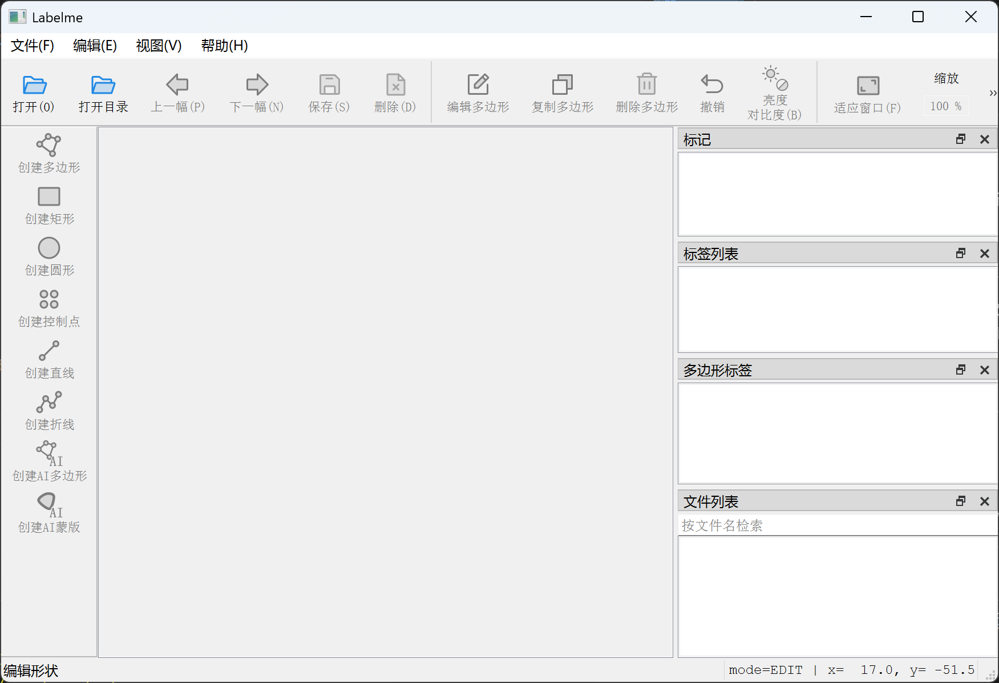
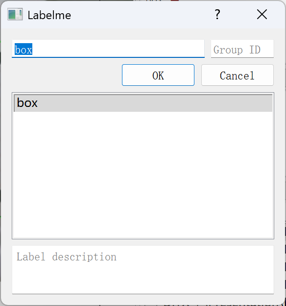

# YOLODetectorTrainer

`YOLODetectorTrainer` , 在 `ultralytics` 的 `YOLO` 的基础上添加了数据集预处理、默认训练参数和常见配置，旨在使初学者使用 `YOLO` 模型进行目标检测时更为方便。

## 数据集准备

在开始进行训练之前，需要先对数据集进行准备。

首先拍摄 `大量未标注的图片`，然后存入一个 `空白文件夹` 中。文件夹中应该有且只有图片。

接下来进行数据标注。

## LabelMe标注

数据标注的软件我们选择 `LabelMe`。

请注意：`LabelMe` 是一个独立的软件，你需要在另一个文件夹，例如 `C:\PortableProgram\LabelMe` 之中完成 `LabelMe` 的安装工作。

### 1. 新建venv虚拟环境

```Shell
cd <your-favor-labelme-install-path>
python -m venv venv
```

### 2. 激活虚拟环境

Windows:
```PowerShell
./venv/Scripts/activate
```

Linux:
```Bash
./venv/bin/activate
```

### 2. 安装labelme

```Shell
pip3 install labelme
```

### 3. 启动LabelMe

```Shell
labelme
```

### 4. 界面显示

接下来你会看到如下图所示的LabelMe界面。



## 数据标注

从左侧的标注工具中选择 `创建矩形`，在画面中对 `需要被检测的目标` 拉框进行标注。

拉框之后弹出如下所示的标签输入框：



在上方 `工具栏` 找到 `保存` 按钮并点击，或按下键盘快捷键 `Ctrl + S`，将 `标签文件` 保存在与 `图片文件` 相同的文件夹中。

标注下一张图片，直到所有图片都被妥善标注。

备份整个图片文件夹。

## 数据集预处理

修改 `prepare.py` 文件中的 `dataset_raw_path = "<your-dataset-path>"` 变量的值为你的标注后的数据集的路径，运行 `prepare.py` 文件。运行过后：

文件夹 `exp\yolo` 为整理过后的数据集。

文件 `YOLODataset.zip` 为数据集的压缩包，适用于云端训练。

云端训练之前，需要先运行数据集内的 `relocated.py`：

```Shell
python relocated.py
```

这个步骤的目的是修复 `data.yaml` 中的数据集路径。

每当移动这个数据集时，都需要重新重定位。

## 训练指南

### 1. 先创建虚拟环境
```PowerShell
python -m venv venv
```
### 2. 激活虚拟环境

Windows:
```PowerShell
./venv/Scripts/activate
```

Linux:
```Bash
./venv/bin/activate
```
### 3. 安装torch
```PowerShell
pip3 install torch torchvision --index-url https://download.pytorch.org/whl/cu130
```
### 4. 安装其它依赖
```PowerShell
pip3 install -r requirements.txt
```